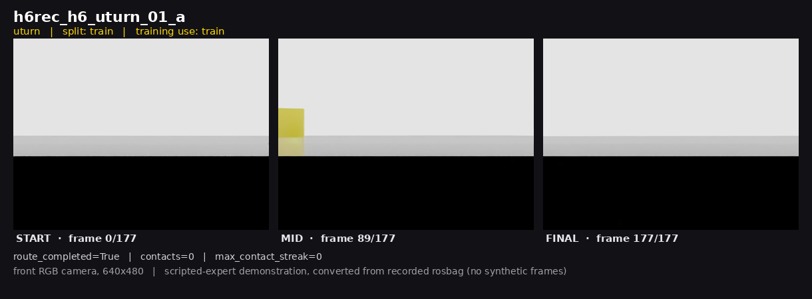
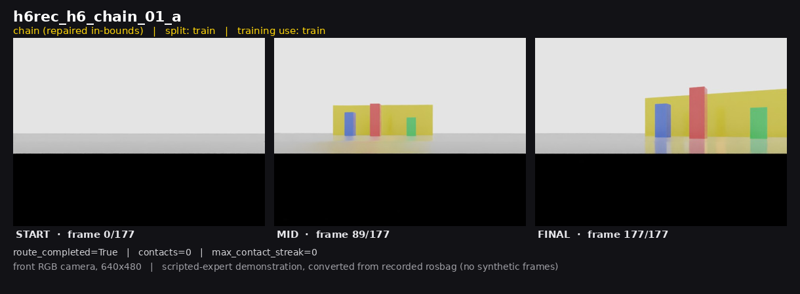
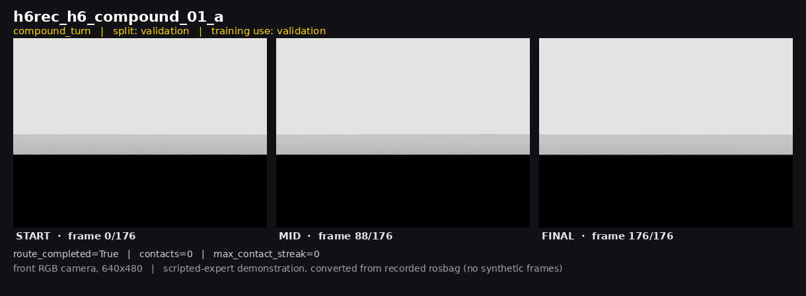
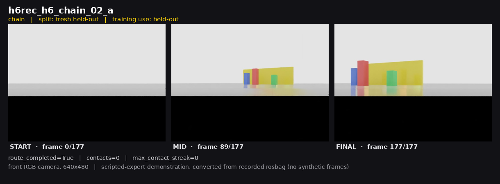

# H6 Hard-Route Coverage Diagnostic — Camera-Only ImageNav

Frank Asante Van Laarhoven · 2026-07-13 · prepared for Prof. Bo Wei
Internal Isaac-Hospital-ImageNav-v0 simulation · branch `h23-execfix`, commit `bfb595f`

All camera frames in this deck are **real** converted front-RGB frames
(`datasets/isaac_hospital_h6/`, 640×480) — no synthetic images, no placeholders.
Full narrative: `h6_professor_report.md`; one-page handout: `h6_professor_one_page_handout.md`.

---

## 1 · Research question
Does adding **clean hard-route families** (uturn / chain / ftL / sharp-multi-turn /
tight-corridor) to *training* produce success on **held-out hard-route families** —
i.e. is the H5 shortfall a route-family *coverage* gap rather than a data-balance gap?

## 2 · Why H6 was needed after H5
H5 improved trajectory fidelity but **regressed on a prior family** (prior-held-out
SR 0.167 → 0.000; it lost the `ftL` family the incumbent could do) and still reached
no success on hard families. → `h6_per_family_failure_table.json`

---

## 3 · What was collected + setup
- **16 / 16 clean** scripted-expert recordings — `route_completed=True`, **0 collisions**,
  clean DDS/process cleanup. → `h6_recording_quality_table.csv`
- **Leakage-clean** split; single fixed goal image. → `h6_conversion_leakage_report.json`
- Split **train 10 / val 2 / fresh-hard held-out 4**.
- MobileNetV2-GNM, weights-only init from **H1 incumbent**, fresh optimizer, seed 42,
  selected on H6 validation; offline Track-A eval, data-root forced. → `h6_eval_matrix.csv`

---

## 4 · Key results (offline Track-A) → `h6_eval_matrix.csv`, `h6_per_family_failure_table.csv`
| Held-out set (n) | Metric | H1 | H5 | **H6** |
|---|---|---|---|---|
| H4 held-out (6) | SR / NE (m) | 0.00 / 14.04 | 0.333 / 5.02 | **0.333 / 6.15** |
| **Fresh hard (4)** | SR / OSR / NE | 0.00 / 0.00 / 21.36 | 0.00 / 0.00 / 8.25 | **0.00 / 0.00 / 10.58** |
| Prior held-out (6) | SR / NE | 0.167 / 12.76 | 0.000 / 7.19 | **0.167 / 7.73** |
| Combined (12) | SR / nDTW | 0.083 / 0.222 | 0.167 / 0.336 | **0.250 / 0.351** |

Best combined **SR = 0.25** and **nDTW = 0.351** (H6); H4 gain preserved; H5 prior-family
regression removed; **fresh hard families still SR = 0 and OSR = 0**.

---

## 5 · Interpretation + limitations
Route-family coverage **helps aggregate quality** and **repairs the older-family
regression**, but the model **never reaches within the 3 m success radius on unseen
hard-family instances** (OSR = 0). Held-out instances are only a/b repeats of trained
routes ⇒ **simple a/b variants are not enough**. Diagnostic only — **not promoted**
(VerdictPlane deny, H1 retained; `h6_adjudication.json`). Fixed placeholder goal ⇒
**not goal-conditioning evidence**; scripted-expert; sim-only; offline; small n; one seed.
→ `h6_claim_boundary.md`

## 6 · Next experiment
Collect **instance-diverse hard-route data** (distinct routes, not a/b repeats) and
evaluate under a **non-fixed, goal-conditioned** protocol against real goal images.

---

## 7 · Actual H6 front-camera evidence
Real converted front-RGB frames (640×480) from four episodes — start → mid → final.
Labels are read from `h6_recording_ledger.json`; all four are `route_completed=True`,
`contacts=0`, `max_contact_streak=0`. Provenance: `h6_front_camera_exports/h6_front_camera_exports_manifest.json`.

**Train — `h6_uturn_01_a` (uturn)**

**Repaired in-bounds route — `h6_chain_01_a` (chain)**

**Validation — `h6_compound_01_a` (compound_turn)**

**Fresh held-out — `h6_chain_02_a` (chain, unseen instance)**

---

## Conclusion
**H6 is the strongest diagnostic result so far, but not a promotion result.** It shows
hard-route coverage improves aggregate performance and fixes the older-family regression,
but fresh hard-family generalisation still fails. H6 supports the coverage-gap diagnosis
but does not confirm hard-family generalisation; the next step is instance-diverse
hard-route data and non-fixed goal-conditioned evaluation.
