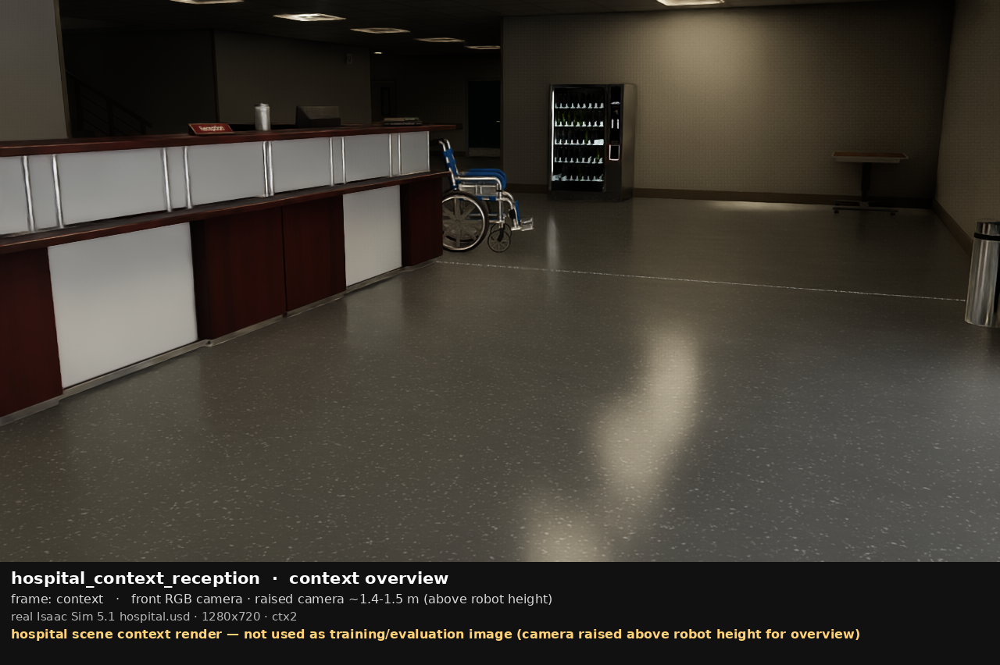
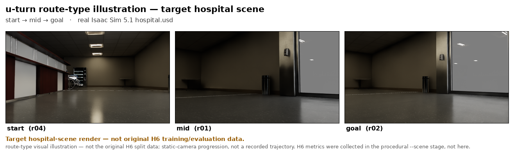
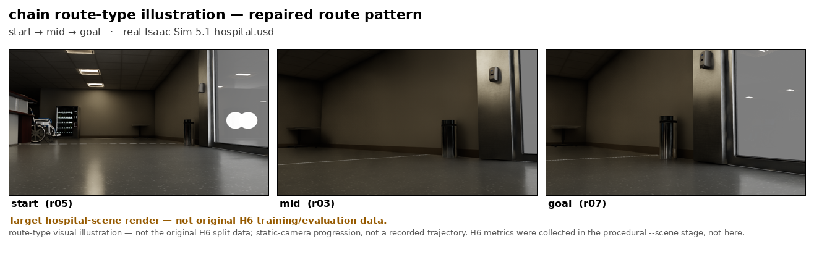
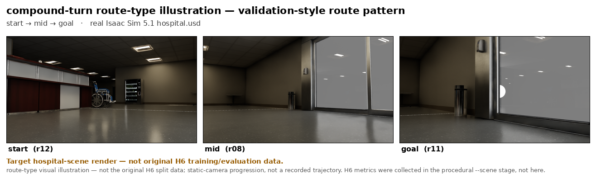
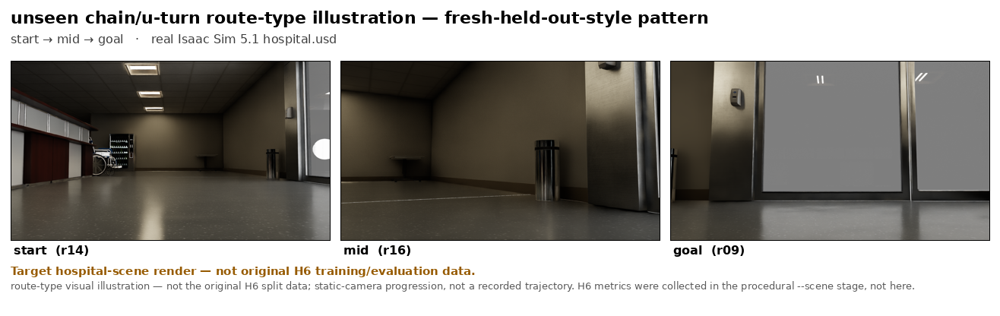

# H6 Hard-Route Coverage Diagnostic — corrected deck

**Frank Asante Van Laarhoven · 13 July 2026 · prepared for Prof. Bo Wei**
**Diagnostic evidence — NOT a promoted model. Incumbent (H1) retained.**

This deck has **two separate parts**, kept strictly apart:

- **(A) route-family coverage DIAGNOSTIC** — quantitative, collected in the procedural
  bring-up stage (`--scene stage`); scene-agnostic.
- **(B) hospital TARGET-SCENE visuals** — newly rendered from the real Isaac Sim 5.1
  `hospital.usd`; direction for the next run, **not** training/evaluation data.

Supersedes the visual portion of `h6_professor_deck.md` (which showed procedural-stage
grey frames). The quantitative result is unchanged.

---

## Slide 2 — Correction: scene of record vs. target scene

> Please read before the visuals.

- The earlier deck's frames were rendered in the bring-up **default** procedural stage
  (`--scene stage`): a grey floor with a few coloured-block landmarks — **NOT** the Isaac
  hospital asset. Those images are **withdrawn** as hospital evidence.
- The H6 **quantitative** result is unaffected: it is a route-family coverage diagnostic
  over trajectory geometry (u-turn, chain, forward-then-L, sharp-multi-turn, tight-corridor),
  which is scene-agnostic. **No metric changes.**
- Section-B images below are **static-camera target-scene renders** — they are **not** the
  H6 training/evaluation frames, and **no H6 metric was collected in the hospital scene**.
- **H6 metrics were collected in the procedural `--scene stage`; hospital renders validate the
  intended target scene for the next run.**

---

## (A) Diagnostic — procedural `--scene stage` — quantitative

### Question, and why H6 after H5
- Models: **H1** = retained incumbent; **H5** = prior diagnostic (mixed-family replay);
  **H6** = current diagnostic (added hard-route coverage).
- Question: does adding clean hard-route families to **training** produce success on
  **held-out** hard families?
- H5 improved trajectory fidelity but **regressed** on a prior family (Success Rate
  0.167 → 0.000: it lost forward-then-L) and still reached no hard-family success.
- So the open question is whether this is a route-family **coverage** gap.

### What was collected, and the setup
- 16/16 clean scripted-expert recordings: route completed, 0 collisions, clean shutdown;
  leakage-clean split (no episode or family shared across splits).
- Split: **10 train / 2 val / 4 fresh hard held-out** (unseen instances of trained types).
- Model: General Navigation Model (GNM) with a MobileNetV2 image encoder.
- Weights-only init from H1, fresh optimiser, one seed; checkpoint selected on val.
- Offline Track-A (open-loop) evaluation, data root fixed for every model.
- Collected in the procedural `--scene stage`; scene geometry is irrelevant to the
  route-family coverage question.

### Results: H1 vs H5 vs H6

| Held-out set (n)     | H1  SR / NE   | H5  SR / NE   | H6  SR / NE   |
|----------------------|---------------|---------------|---------------|
| H4 held-out (6)      | 0.00 / 14.04  | 0.333 / 5.02  | 0.333 / 6.15  |
| Fresh hard (4)       | 0.00 / 21.36  | 0.00 / 8.25   | 0.00 / 10.58  |
| Prior held-out (6)   | 0.167 / 12.76 | 0.000 / 7.19  | 0.167 / 7.73  |
| Combined (12)        | 0.083 / 13.40 | 0.167 / 6.10  | **0.250 / 6.94** |

- Best combined **SR = 0.25** and best **nDTW = 0.351** are both H6; H6 also **fixes** H5's
  prior-family regression.
- Fresh hard families: **SR = 0 and OSR = 0 for all three models.**
- SR = Success Rate; NE = Navigation Error (m); OSR = Oracle SR; nDTW = normalised Dynamic
  Time Warping.

### Interpretation and limitations
- Route-family coverage helps aggregate quality and removes H5's older-family regression.
- But the model never reaches within the 3 m success radius on unseen hard-family instances
  (OSR = 0). Held-out routes are only a/b repeats, so simple a/b variants are not enough.
- Limitations: fixed placeholder goal image (**not** goal-conditioning evidence);
  scripted-expert demos; simulation only; offline eval; small n (4/6/12); one seed.
- **Diagnostic only — not promoted; incumbent retained; no SOTA claim; not real-robot evidence.**

---

## (B) Hospital target scene — real Isaac 5.1 `hospital.usd` — visuals only

**Asset:** `.../Assets/Isaac/5.1/Isaac/Environments/Hospital/hospital.usd`
**Verified:** 1909 prims loaded, RTX ray-traced, robot-height (0.35 m) front RGB camera,
1280×720. `synthetic: false`, `placeholder: false`. Fail-closed on asset identity.

> Every image below carries the warning **"Target hospital-scene render — not original H6
> training/evaluation data."** Route labels are **route-TYPE illustrations**, not the original
> H6 split data; each is a static-camera view, not a recorded navigation trajectory.

### Asset verified (context overview)

*hospital scene context render — camera raised above robot height; not used as a
training/evaluation image.*

### Target-scene re-renders (route-type illustrations, start → mid → goal)
- **u-turn route-type illustration — target hospital scene**
  
- **chain route-type illustration — repaired route pattern**
  
- **compound-turn route-type illustration — validation-style route pattern**
  
- **unseen chain/u-turn route-type illustration — fresh-held-out-style pattern**
  

Each contact sheet: real `hospital.usd`, robot-height front camera, warning
"Target hospital-scene render — not original H6 training/evaluation data."

---

## Conclusion and next experiment
- **(A)** H6 is the strongest diagnostic so far — not a promotion: hard-route coverage
  improves aggregate performance and fixes the older-family regression, but fresh
  hard-family generalisation still fails (OSR = 0).
- **(B)** The intended hospital scene is verified and renders correctly at robot height;
  the earlier grey-stage visuals are withdrawn and replaced with these target-scene renders.
- **Next experiment:**
  - re-run collection **and** evaluation with `--scene hospital` so metrics and visuals
    share one scene;
  - collect instance-diverse hard routes (distinct routes, not a/b repeats);
  - evaluate under a non-fixed, goal-conditioned protocol against real goal images.

---

### Artifacts
- Visuals: `hospital_render_exports/` (4 routes × start/mid/goal + contact sheet, 2 context, manifest)
- Candidates + montage: `hospital_render_candidates/`
- Asset smoke proof: `hospital_asset_smoke_exports/`
- PPTX: `~/Desktop/H6_Professor_Update_Corrected.pptx`
- Manifest: `hospital_render_exports/hospital_render_manifest.json` (asset path, prim count,
  render mode, camera, claim boundary)
